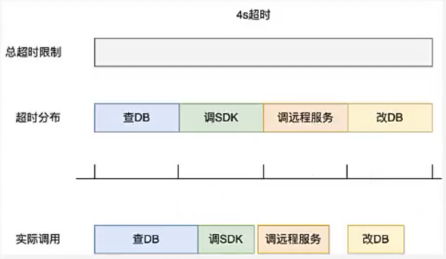
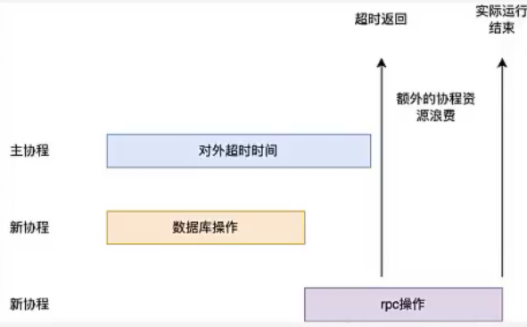
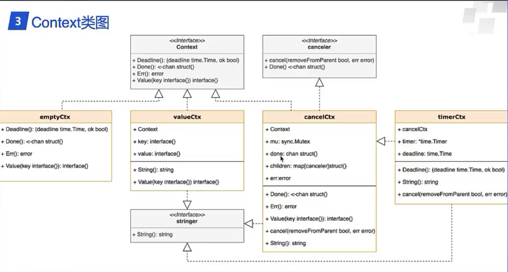
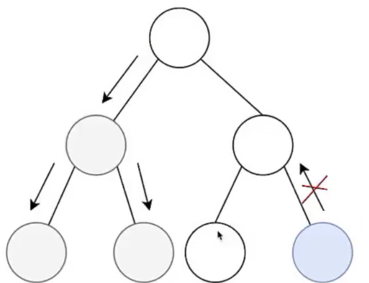

[相关视频讲解](https://www.zhihu.com/zvideo/1571610070282186752)

# 控制子协程
## 如何控制子协程退出？
由于协程不像C++/JAVA有个线程ID可以直接操作，只能通过协程自己退出的方式关闭。
通过channel通知协程关闭是常见的实现方式

```go
package main

import (
	"fmt"
	"time"
)

// 通过通道控制协程退出
func main(){
	closed:=make(chan struct{})
	for i:=0;i<2;i++{
		go func(i int){
			// do something
			select{
			case <-closed:
				fmt.Printf("%d Timeout\n",i)
			}
		}(i)
	}

	ta:=time.After(time.Second*3)
	select{
	case <-ta:
		close(closed)
	}
	time.Sleep(time.Second)
}
```

## 简单并发控制的缺陷

### 问题1
每个小阶段要独立划分超时时间，难以复用
**场景描述**：
假设给一个接口设定的总超时时间是4s，该接口涉及的子接口有"查DB、调SDK、调远程服务、改DB"，
给每个子接口设定的超时时间是1s，由于慢查询导致子接口查DB超时报错，但是整个的接口调用并没有超过4s


### 问题2
每个协程要独立的channel，否则父协程退出，子协程仍在运行
为了做到精细化控制，需要给每个协程配有一个channel，不然有可能主协程退出，有些子协程仍在运行，导致内存泄漏、资源浪费。





# Context
## 源码给出的说明

context包定义了Context类型，用于跨API边界和进程间传递截止时间、取消信号以及其它请求作用域的值

服务端接收到请求时应创建\[Context]，而向服务端发起的调用应接收Context
函数调用链之间必须传递Context，可选择性地将其替换为派生Context(通过\[WithCancel]、\[WithDeadline]、\[WithTimeout]或\[WithValue]创建)


当某个Context被取消时，其派生的所有Context也会被取消
\[WithCancel]、\[WithDeadline]和\[WithTimeout]函数接收父Context，返回派生Context和\[CancelFunc]
调用CancelFunc将取消子Context及其派生Context、解除父子引用关系并停止相关计时器。
如果没有及时调用CancelFunc，会导致子Context及其派生Context泄漏，直到父Context被取消或计时器到期。

go vet工具会检查所有控制流路径是否正确使用了CancelFunc

\[WithCancelCause]函数会返回\[CancelCauseFunc]，接收error参数并将其记录为取消原因
对被取消的Context或子Context调用\[Cause]可获取该原因：
若未指定原因，Cause(ctx)返回值与ctx.Err()相同


使用Context的程序应当遵守以下规则，以保持接口一致性并支持静态分析工具检查上下文传播：
1. 不要将Context存储在结构体中，而是应该显式地传递给每个需要它的函数
```go
// Context应该作为第一参数，通常命名为ctx
func DoSomething(ctx context.Context, arg Arg)error{
	// 使用ctx
}
```

2. 即使函数允许，也不应该传递nil Context。若不确定使用哪个Context，应该传入\[context.TODO()]
3. 仅将context Values用于跨进程和API传递请求作用域数据，而非函数可选参数
4. 同一个Context可被多个goroutine并发使用
服务器使用Context的示例代码详见 ： [https://blog.golang.org/context](https://blog.golang.org/context)


## Context接口

context.Context本质上是一个接口，提供了四种方法

```go
type Context interface {

	Deadline() (deadline time.Time, ok bool)

	Done() <-chan struct{}

	Err() error

	Value(key any) any
	// type any = interface{}
}
```

+ `Deadline`。
	+ 返回截止时间和是否包含截止时间标志。连续调用`Deadline`返回相同的结果
+ `Done`。
	+ 返回一个通道，ctx被取消时该通道会关闭。
	+ 如果此上下文永远不会被取消，Done可能返回nil
	+ 连续调用Done返回相同的值
	+ Done通道的关闭可能在取消函数返回后异步发生
	+ WithCancel会在cancel被调用时关闭Done通道
	+ WithDeadline会在截止时间到达时关闭Done通道
	+ WithTimeout会在超时时关闭
	+ Done方法主要用于select语句中
```go
// Stream通过DoSomething生成值并发送到out通道
// 直到DoSomething返回错误或ctx.Done被关闭
func Stream(ctx context.Context,out chan<-Value)error{
	for{
		v,err:=DoSomething(ctx)
		if err!=nil{
			return err
		}
		select{
		case <-ctx.Done:
			return ctx.Err()
		case out<-v:
			
		}
	}
}
```

+ `Err`。
	+ 如果`Done`尚未关闭，Err返回nil
	+ 如果Done已经关闭，Err返回错误说明
		+ Canceled。上下文被取消
		+ DeadlineExceeded。截止时间已过
	+ 一旦Err返回非nil错误，后续调用将返回相同的错误
+ `Value`。
	+ Value返回与此上下文关联的键key对应的值，若无关联值返回nil
	+ 对同一键key的连续Value调用返回相同结果
	+ 应仅将上下文值用于跨越进程和API边界的请求作用域数据传递，而非作为函数的可选参数传递机制
	+ key用于标识Context中的特定值
	+ 需要在Context中存储值的函数，通常在全局变量中声明一个key，将其作为参数传递给context.WithValue和Context.Value
	+ 为避免冲突，应将key定义为非导出类型
	+ 定义Context key的包应提供类型安全的访问器获取对应值
```go
// user包定义了存储在Context的User类型
package user
import context

// User是存储在Context中的值类型
type User struct{...}

// key是本包中定义的未导出键类型
// 可以防止与其它包定义的键冲突
type key int 
// userkey是Context中user.User的键
// 该键未导出，客户端应使用user.NewContext和user.FromContext,而非直接使用该键
var userKey key
// NewContext返回携带值u的新Context
func NewContext(ctx context.Context,u *User)context.Context{
	return context.WithValue(ctx,userkey,u)
}
// FromContext获取存储在ctx中的User值
func FromContext(ctx context.Context)(*User,bool){
	u,ok:=ctx.Value(userKey).(*User)
	return u,ok
}
```


## Context的四种实现


### emptyCtx
**一个空的Ctx，一般用做根节点**
```go
// emptyCtx从不会被取消，没有values，没有deadline
// emptyCtx是backgroundCtx和todoCtx的基础
type emptyCtx struct{}

func (emptyCtx) Deadline() (deadline time.Time, ok bool) {
	return
}
 
func (emptyCtx) Done() <-chan struct{} {
	return nil
}

func (emptyCtx) Err() error {
	return nil
}

func (emptyCtx) Value(key any) any {
	return nil
}


type backgroundCtx struct{ emptyCtx }

// Background返回一个non-nil的emptyCtx。从不会被取消，没有值
// 没有截止时间。通常被主函数、初始化、测试使用，并作为传入的根Context
func Background() Context {
	return backgroundCtx{}
}
// TODO返回一个non-nil的emptyCtx。当不清楚该使用哪个Context时
// 或者Context还不可用时，应该使用context.TODO.
type todoCtx struct{ emptyCtx }
// 
func TODO() Context {
	return todoCtx{}
}

```

### cancelCtx
**核心实现，用来处理取消相关的操作**

cancelCtx除了实现Context接口之外，还实现了canceler接口

**canceler**

```go
// canceler是一种可以直接取消的context
// 具体实现包括*cancelCtx 和 *timerCtx
type canceler interface {
	cancel(removeFromParent bool, err, cause error)
	Done() <-chan struct{}
}
```
**cancelCtx**
```go
// cancelCtx是一个可以被取消的上下文。当它被取消时，同时也会取消所有实现了canceler接口的children
type cancelCtx struct {
	Context // 嵌入式继承  
	mu sync.Mutex // protects following fields
	done atomic.Value // of chan struct{}, created lazily, closed by first cancel call
	children map[canceler]struct{} // set to nil by the first cancel call
	err error // set to non-nil by the first cancel call
	
	cause error // set to non-nil by the first cancel call
}

// &cancelCtxKey是cancelCtx用于标识自身返回的键值
var cancelCtxKey int

func (c *cancelCtx) Value(key any) any {
	if key == &cancelCtxKey {
		return c
	}
	return value(c.Context, key)
}

func value(c Context, key any) any {
	for {
		switch ctx := c.(type) {
		case *valueCtx:
			// 如果ctx是valueCtx
			// 直接对比ctx中存储的key
			if key == ctx.key {
				return ctx.val
			}
			// 继续向上查找
			c = ctx.Context
		case *cancelCtx:
			if key == &cancelCtxKey {
				return c
			}
			c = ctx.Context
		case withoutCancelCtx:
			if key == &cancelCtxKey {
				// This implements Cause(ctx) == nil
				// when ctx is created using WithoutCancel.
				return nil
			}
			c = ctx.c
		case *timerCtx:
			if key == &cancelCtxKey {
				return &ctx.cancelCtx
			}
			c = ctx.Context
		case backgroundCtx, todoCtx:
			return nil
		default:
			return c.Value(key)
		}
	}
}

// Done返回的通道懒式创建，并且第一次调用cancel时关闭  
func (c *cancelCtx) Done() <-chan struct{} {
	// 原子加载done通道
	d := c.done.Load()
	// d不为nil直接返回
	if d != nil {
		return d.(chan struct{})
	}
	// d为nil加锁新建，类型为chan struct{}
	c.mu.Lock()
	defer c.mu.Unlock()
	d = c.done.Load()
	// 双检测，d为nil新建
	if d == nil {
		d = make(chan struct{})
		c.done.Store(d)
	}
	return d.(chan struct{})
}

// 获取done被关闭的原因，第一次调用cancel时被设置
func (c *cancelCtx) Err() error {
	c.mu.Lock()
	err := c.err
	c.mu.Unlock()
	return err
}


// closedchan is a reusable closed channel.
var closedchan = make(chan struct{})
func init() {
	close(closedchan)
}

// cancel方法会关闭c.done通道，取消所有子上下文(c's children)
// 如果removeFromParent为true，还会从父上下文的列表(parents's children)中移除当前上下文c
// 如果是首次取消该上下文，会将取消原因保存到c.cause
func (c *cancelCtx) cancel(removeFromParent bool, err, cause error) {
	if err == nil {
		panic("context: internal error: missing cancel error")
	}

	// 首次取消将cause设置为err
	if cause == nil {
		cause = err
	}
	
	c.mu.Lock()
	// c.err不为nil说明不是第一次取消，已经被设置过
	if c.err != nil {
		c.mu.Unlock()
		return // already canceled
	}

	// 第一次被取消将c.err设置为err
	c.err = err
	c.cause = cause
	d, _ := c.done.Load().(chan struct{})

	// 由于d是懒创建的模式，所以d有可能为nil，需要特殊处理
	if d == nil {
		// closedchan是一个可以复用的已经关闭的通道
		c.done.Store(closedchan)
	} else {
		close(d)
	}

	// 将当前节点的所有子树节点全部取消
	for child := range c.children {
		// 注意：在持有父锁的情况下获取子锁
		// 解释一下这里的removeFromParent为什么是false
		// 为true的情况下需要用父节点的children中移除，需要获取父节点的锁，但是此时还持有着父节点的锁
		// 为防止二次加锁，所以设置为false
		child.cancel(false, err, cause)
	}

	// 第一次cancel时，c.children被置为nil
	c.children = nil
	c.mu.Unlock()

	// 如果removeFromParent为true
	// 从父节点的children列表中移除节点c
	if removeFromParent {
		removeChild(c.Context, c)
	}
}


// removeChild removes a context from its parent.
func removeChild(parent Context, child canceler) {
	if s, ok := parent.(stopCtx); ok {
		s.stop()
		return
	}

	// 找到parent中的*cancelCtx
	p, ok := parentCancelCtx(parent)
	if !ok {
		return
	}
	p.mu.Lock()
	if p.children != nil {
		// 从p的children列表中删除当前节点
		delete(p.children, child)
	}
	p.mu.Unlock()
}


// parentCancelCtx返回父上下文的*cnacelCtx
// 它通过查找parent.Value(&cancelCtxKey)找到
// 最内层的包围的*cancelCtx，然后检查父上下文的Done方法是否与该*cnacelCtx匹配
// 如果不匹配则说明这个*cancelCtx被包装在提供了不同通道的自定义实现中

func parentCancelCtx(parent Context) (*cancelCtx, bool) {
	// 获取parent的done通道
	done := parent.Done()
	// 父done通道已经被关闭
	if done == closedchan || done == nil {
		return nil, false
	}
	// 通过Value方法获取parent中的*cancelCtx
	p, ok := parent.Value(&cancelCtxKey).(*cancelCtx)
		if !ok {
		return nil, false
	}
	// 找到了*cancelCtx，获取其中的done通道
	pdone, _ := p.done.Load().(chan struct{})
	// 自定义实现Done()方法
	// channel是引用类型，比较两个channel是否指向同一个底层channel对象
	if pdone != done {
		return nil, false
	}
	return p, true
}
```

### timerCtx
用来处理超时相关的操作

```go
// timerCtx携带一个计时器和截止时间，内嵌cancelCtx
// 实现了Done方法和Err方法
// 通过先停止自己的计时器，然后委托给cancelCtx.cancel实现取消操作
type timerCtx struct {
	cancelCtx
	timer *time.Timer // Under cancelCtx.mu.
	deadline time.Time
}


func (c *timerCtx) Deadline() (deadline time.Time, ok bool) {
	return c.deadline, true
}

func (c *timerCtx) cancel(removeFromParent bool, err, cause error) {
	c.cancelCtx.cancel(false, err, cause)
	if removeFromParent {
		// Remove this timerCtx from its parent cancelCtx's children.
		removeChild(c.cancelCtx.Context, c)
	}
	c.mu.Lock()
	// 如果提前被取消，需要停止计时器
	if c.timer != nil {
		c.timer.Stop()
		c.timer = nil
	}
	c.mu.Unlock()
}
```

### Ctx被取消的两种原因

| 类型          | 取消类型             | 具体原因                      |
| ----------- | ---------------- | ------------------------- |
| \*cancelCtx | Canceled         | context canceled          |
| \*timerCtx  | DeadlineExceeded | context deadline exceeded |

```go
// Canceled is the error returned by [Context.Err] when the context is canceled.
var Canceled = errors.New("context canceled")

  
// DeadlineExceeded is the error returned by [Context.Err] when the context's deadline passes.
var DeadlineExceeded error = deadlineExceededError{}
type deadlineExceededError struct{}
func (deadlineExceededError) Error() string { return "context deadline exceeded" }
```
### valueCtx
附加值的实现方法

```go
type valueCtx struct {
	Context
	key, val any
}

func (c *valueCtx) Value(key any) any {
	if c.key == key {
		return c.val
	}
	return value(c.Context, key)
}

```

# context基础用法


| 实现        | 调用接口                                    |
| --------- | --------------------------------------- |
| emptyCtx  | context.TODO or context.Background      |
| cancelCtx | context.WithCancel                      |
| timerCtx  | context.WithTimeout or context.Deadline |
| valueCtx  | context.WithValue                       |
## context.TODO() && context.Background()
这两个方法完全等价，一般用来生成ctx依赖树的父节点

```go
func Background() Context {
	return backgroundCtx{}
}

func TODO() Context {
	return todoCtx{}
}
```

## context.WithCancel()
```go
// WithCancel返回父上下文的副本以及一个新的Done通道
// 当调用返回的取消函数或父上下文的Done通道关闭时(先发生者为准)，返回的上下文的Done通道将会关闭
// 取消上下文会释放与其关联的资源，因此代码应在运行结束后立即调用cancel

// 函数原型
func WithCancel(parent Context) (ctx Context, cancel CancelFunc) {
	c := withCancel(parent)
	return c, func() { c.cancel(true, Canceled, nil) }
}

func withCancel(parent Context) *cancelCtx {
	if parent == nil {
		panic("cannot create context from nil parent")
	}
	c := &cancelCtx{}
	// 将c的Context设置为parent
	// 找到parent中的cancelCtx
	// 将c加入到该cancelCtx的child列表
	c.propagateCancel(parent, c)
	return c
}


// propagateCancel负责在父上下文被取消时也取消子上下文
// 会设置cancelCtx的父上下文
func (c *cancelCtx) propagateCancel(parent Context, child canceler) {
	// cancelCtx嵌入的Context实际上是parent父节点
	c.Context = parent
	// 获取parent的done通道
	done := parent.Done()
	
	if done == nil {
		return // parent is never canceled
	}
	// 非阻塞监听parent的done通道
	select {
	case <-done:
		// parent is already canceled
		// 由于该节点还没有加入到parent的children列表，将removeFromParent设置为false
		child.cancel(false, parent.Err(), Cause(parent))
		return
	default:
	}

	// 获取parent中的*cancelCtx
	if p, ok := parentCancelCtx(parent); ok {
		// parent is a *cancelCtx, or derives from one.
		p.mu.Lock()
		// p.err!=nil说明父节点已经被取消，取消子节点
		if p.err != nil {
			// parent has already been canceled
			child.cancel(false, p.err, p.cause)
		} else {
			// 父节点还没有被取消
			// 懒创建模式
			if p.children == nil {
				p.children = make(map[canceler]struct{})
			}
			p.children[child] = struct{}{}
		}
		p.mu.Unlock()
		return
	}

	// parent中没有*cancelCtx,但是parent实现了afterFuncer接口
	if a, ok := parent.(afterFuncer); ok {
		// parent implements an AfterFunc method.
		c.mu.Lock()
		stop := a.AfterFunc(func() {
			child.cancel(false, parent.Err(), Cause(parent))
		})
		
		c.Context = stopCtx{
			Context: parent,
			stop: stop,
		}
		c.mu.Unlock()
		return
	}
	
	goroutines.Add(1)

	// 开启新的协程监听parent.Done()和child.Done()
	go func() {
		select {
		case <-parent.Done():
			child.cancel(false, parent.Err(), Cause(parent))
		case <-child.Done():
		}
	}()
}

// 用法
ctx,cancel:=context.WithCancel(parentCtx)


// 一般操作比较耗时或者涉及远程调用等，都会在输入参数里带上ctx
// 这也是大多数公司代码规范里提倡的
func Do(ctx context.Context,...){
	ctx,cancel:=context.WithCancel(parentCtx)
	// 实现某些业务逻辑

	// 遇到某种条件，比如程序出错，取消ctx
	// ctx绑定的子协程也跟着退出
	if err!=nil{
		cancel()
	}
}
```

主动取消函数可以在任意时机调用；调用后终止当前ctx子节点以及往下的所有孙子ctx节点。形成连锁退出的效果。

## context.WithTimeout
附带超时能力

```go
// WithTimeout等价于调用WithDeadline
// 

// 函数原型
func WithTimeout(parent Context, timeout time.Duration) (Context, CancelFunc) {
	return WithDeadline(parent, time.Now().Add(timeout))
}

// 用法
ctx,cancel:=context.WithTimeout(parentCtx,time.Second*5)
func slowOperationWithTimeout(ctx context.Context) (Result, error) { 
	ctx, cancel := context.WithTimeout(ctx, 100*time.Millisecond)
	defer cancel() //如果 slowOperation 在超时前完成，则释放资源 
	return slowOperation(ctx) 
}

// 一般操作比较耗时或者涉及远程调用等，都会在输入参数里带上ctx
// 这也是大多数公司代码规范里提倡的
func Do(ctx context.Context,...){
	ctx,cancel:=context.WithTimeout(parentCtx,time.Second*5)
	// 实现某些业务逻辑

	for {
		select{
		// 轮询检测是否已经超时
		case <-ctx.Done():
			return
		// 有时也会附加错误判断
		case <-errCh:
			cancel()
		default:
		
		}
	}
}
```

现在大部分go库都会监听ctx.Done，只需要传入ctx即可

## context.Deadline
附带截止时间能力

```go
// WithDeadline返回parent Ctx的副本，并将截止时间调整为不晚于d
// 如果parent Ctx的截止时间早于d，则WithDeadline在语义上等效于直接返回parent Ctx
// 以下三种情况，最先发生时将关闭返回的[Context.Done]通道
// 1.截止时间到期
// 2.调用返回的cancel函数
// 3.parent Ctx 的Done通道被关闭

func WithDeadline(parent Context, d time.Time) (Context, CancelFunc) {
	return WithDeadlineCause(parent, d, nil)
}


// WithDeadlineCause的行为与WithDeadline类似，但超过截止时间会设置返回的Context原因
func WithDeadlineCause(parent Context, d time.Time, cause error) (Context, CancelFunc) {
	if parent == nil {
		panic("cannot create context from nil parent")
	}
	
	if cur, ok := parent.Deadline(); ok && cur.Before(d) {
		// The current deadline is already sooner than the new one.
		// 父节点在子节点过期之前过期，子节点可以不设置deadline，等价于WithCancel
		return WithCancel(parent)
	}
	c := &timerCtx{
		deadline: d,
	}

	// 找到parent中的cancelCtx
	// 将c加入到该cancelCtx的child列表
	c.cancelCtx.propagateCancel(parent, c)
	
	dur := time.Until(d)
	
	if dur <= 0 {
		// 已经过期直接调用cancel
		c.cancel(true, DeadlineExceeded, cause) // deadline has already passed
		return c, func() { c.cancel(false, Canceled, nil) }
	}
	
	c.mu.Lock()
	defer c.mu.Unlock()
	if c.err == nil {
		// 设定定时器超时取消
		c.timer = time.AfterFunc(dur, func() {
			c.cancel(true, DeadlineExceeded, cause)
		})
	}
	return c, func() { c.cancel(true, Canceled, nil) }

}


// 用法
ctx,cancel:=context.WithDeadline(parentCtx,time.Now().Add(5*time.Second))


// 一般操作比较耗时或者涉及远程调用等，都会在输入参数里带上ctx
// 这也是大多数公司代码规范里提倡的
func Do(ctx context.Context,...){
	ddl,_:=time.ParseInLocation("2006-01-02 15:04:05","2022-11-11 00:00:00",time.Local)
	ctx,cancel:=context.WithDeadline(parentCtx,ddl)
	// 实现某些业务逻辑

	for {
		select{
		// 轮询检测是否已经超时
		case <-ctx.Done():
			return
		// 有时也会附加错误判断
		case <-errCh:
			cancel()
		default:
		
		}
	}
}
```

+ context.WithTimeout传入的是相对时间，即还有多久超时
+ context.WithDeadline传入的是绝对时间，即目标时刻

## context.WithValue
附带值

```go
// WithValue返回parent Ctx的一个副本，其中与key相关的值为val
// 仅将上下文values用于在进程和API之间传递的请求范围数据，而不要用于向函数传递可选参数
// 提供的Key必须是可比较的，且不应该为string类型或任何其他内置类型，以避免使用context的包发生冲突
// WithValue的用户应自定义自己的键类型。为避免赋值给interface{}时分配内存
// 上下文键通常使用具体类型struct{}
// 另外，导出的键变量的静态类型是指针或接口

func WithValue(parent Context, key, val any) Context {
	if parent == nil {
		panic("cannot create context from nil parent")
	}
	if key == nil {
		panic("nil key")
	}
	if !reflectlite.TypeOf(key).Comparable() {
		panic("key is not comparable")
	}
	return &valueCtx{parent, key, val}
}

// 用法
ctx:=context.WithValue(parentCtx,"name",123)
// 取出key
v:=ctx.Value("name")

// ex1,http包内存储trace信息
func WithClientTrace(ctx context.Context, trace *ClientTrace)context.Context{
	// ...
	ctx:=context.WithValue(ctx,clientEventContextKey{},trace)
	// ...
}

// ex2,grpc-go里面用于存储metadata
func WithExtraMetadata(ctx context.Context,md metadata.MD)context.Context{
	return context.WithValue(ctx,mdExtraKey{},md)
}
```


# Context高级用法

## 自定义Context

实现Context接口：
如go gin框架，自定义Context接口，以扩展默认context包的功能，也可以当作普通的ctx传递

Map保存链路参数：
自定义参数如用户ID等设置在Keys map。Get/Post请求参数设置在queryCache和formCache中，底层也是map。查找效率相比于默认包的树形查找有很大的提高

```go
// Context is the most important part of gin. It allows us to pass variables between middleware,
// manage the flow, validate the JSON of a request and render a JSON response for example.
type Context struct {
	writermem responseWriter
	Request *http.Request
	Writer ResponseWriter
	
	Params Params
	
	handlers HandlersChain
	
	index int8
	
	fullPath string
	
	engine *Engine
	
	params *Params
	
	skippedNodes *[]skippedNode
	
	// This mutex protects Keys map.
	mu sync.RWMutex
	
	// Keys is a key/value pair exclusively for the context of each request.
	Keys map[string]any
	
	// Errors is a list of errors attached to all the handlers/middlewares who used this context.
	Errors errorMsgs
	
	// Accepted defines a list of manually accepted formats for content negotiation.
	Accepted []string
	
	// queryCache caches the query result from c.Request.URL.Query().
	queryCache url.Values
	
	// formCache caches c.Request.PostForm, which contains the parsed form data from POST, PATCH,
	// or PUT body parameters.
	formCache url.Values
	
	// SameSite allows a server to define a cookie attribute making it impossible for
	// the browser to send this cookie along with cross-site requests.
	sameSite http.SameSite
}
```

提供额外方法:
默认包只有4个基础方法，但是自定义的context可以追加任意多需要的方法
比如gin框架中，保存了http.Request结构，需要读取Query参数时就解析到queryCache中，每次从queryCache直接读取

```go
// QueryArray returns a slice of strings for a given query key.
// The length of the slice depends on the number of params with the given key.
func (c *Context) QueryArray(key string) (values []string) {
	values, _ = c.GetQueryArray(key)
	return
}


func (c *Context) initQueryCache() {
	if c.queryCache == nil {
		if c.Request != nil {
			c.queryCache = c.Request.URL.Query()
		} else {
			c.queryCache = url.Values{}
		}
	}
}

  

// GetQueryArray returns a slice of strings for a given query key, plus
// a boolean value whether at least one value exists for the given key.
func (c *Context) GetQueryArray(key string) (values []string, ok bool) {
	c.initQueryCache()
	values, ok = c.queryCache[key]
	return
}
```

修改默认方法：
可以修改默认的Deadline()\Done()\Err()\Value()的实现方式，提供需要的功能
如gin框架，Deadline\Done\Err默认都传了Request的Ctx，所以基本行为和Request保持一致

```go
// Deadline returns that there is no deadline (ok==false) when c.Request has no Context.
func (c *Context) Deadline() (deadline time.Time, ok bool) {
	if !c.engine.ContextWithFallback || c.Request == nil || c.Request.Context() == nil {
		return
	}
	return c.Request.Context().Deadline()
}

  

// Done returns nil (chan which will wait forever) when c.Request has no Context.
func (c *Context) Done() <-chan struct{} {
	if !c.engine.ContextWithFallback || c.Request == nil || c.Request.Context() == nil {
		return nil
	}
	return c.Request.Context().Done()
}

// Err returns nil when c.Request has no Context.
func (c *Context) Err() error {
	if !c.engine.ContextWithFallback || c.Request == nil || c.Request.Context() == nil {
		return nil
	}
	return c.Request.Context().Err()
}
```

Value改动较大，非特殊Key优先返回自身Keys map存储的值，若不存在再返回Request的Value

```go
// Value returns the value associated with this context for key, or nil
// if no value is associated with key. Successive calls to Value with
// the same key returns the same result.
func (c *Context) Value(key any) any {
	if key == 0 {
		return c.Request
	}
	if key == ContextKey {
		return c
	}
	if keyAsString, ok := key.(string); ok {
		if val, exists := c.Get(keyAsString); exists {
			return val
		}
	}
	if !c.engine.ContextWithFallback || c.Request == nil || c.Request.Context() == nil {
		return nil
	}
	return c.Request.Context().Value(key)
}
```

# Context的缺陷

无法跟踪子Ctx状态：
子Ctx对应的协程处理完成后只能向下传递退出信号，没法向上传递信号
默认的实现里主协程只能通过超时或者主动取消的方式取消子协程，但是没法知道子协程是否处理完成。
此类操作，需要使用sync.WaitGroup





# 总结
**3个特性**
+ 树形结构。每次调用WithCancel，WithTimeout，WithDeadline，WithValue实际是为当前节点在追加子节点。
	+ `timeout=min(子节点timeout,父节点timeout)`，子节点超时时间即使设置的很大也不会有问题
+ 继承性。某个节点被取消，对应的子树也会被全部取消
	+ 不存在子协程资源浪费
+ 多样性。节点存在不同的实现，每个节点都会附带不同的功能
**4个实现**
+ emptyCtx。一个空的Ctx，一般用作根节点。
+ cancelCtx。核心，用来处理取消相关的操作。
+ timerCtx。用来处理超时相关操作。
+ valueCtx。附加值的实现方法
